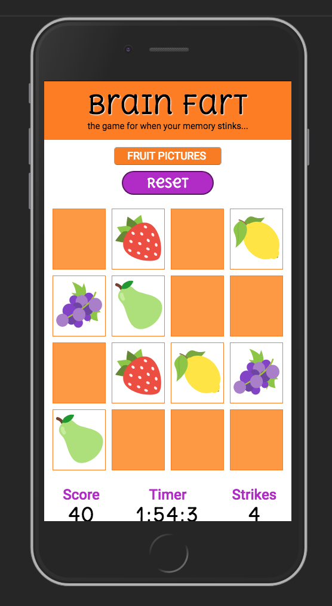

### Proposal 2018 by Steve Hanlon
Make a _Memory Match_ game where all card pairs must be matched to win the game. Experiment with different matching media sets.
 - word to word
 - picture to picture
 - word to picture
 - picture to sound
 - word to sound
 - anigif to word (for sign language)    

**Tablet Screen**

**Small Screen**

**Desktop Screen**

**Modal Window Showing Results and Best Times**

  #### Game Behavior
  - Game board is 4 x 4 grid of 8 hidden card pairs
  - Hidden card pairs are randomly shuffled
  - User clicks on a card and the content is revealed.
  - If two revealed cards match, the paired cards are _kept revealed_
  - If two picked squares don't match they become hidden/covered again
  - A timer running that shows how long it takes to complete the challenge
  - A strikes counter increments up to 10, then the game is lost
  - a points counter increments by 10 every match. Once the points hit 80, the game is won
  - Winning Sequence
    - modal window to congratulate the player
    - show how much time it took to complete the challenge
    - ask to play again or quit
    - Show a __Best Times__ box

  #### Components
  - grid with cards
  - 'Strikes or Stars' display area
    - showing how well the player is doing.  
    - 10 strikes = game over
  - Timer
    - counts up
  - Points
    - 10 points per match; 80 points wins the game
  - Modal Window for Winner
    - Time taken to complete game
    - play again button
    - "Top Five Times" box
  - Reset button to cover cards and reshuffle and
  - Play button to start game

  #### UX Notes
- CSS Grid and Flex Box to make webpage a responsive layout

  #### Workflow
  - Start Read Me and Proposal
  - Make sample array of vocabulary words
  - Make function to load array of words onto DOM in a grid of squares
  - Make initial CSS Flexbox to get Memory Match Grid centered
  - Add Fisher-Yates function to shuffle array words
  - Add Button to trigger Fisher-Yates Shuffle
  - Add TIMER section and function
  - Add SCORE section and function
  - Add STRIKES section and function
  - Add Click Event logic to compare 'Card' values
  - Add Card covers and animation to show word underneath
  - Add sounds for action
  - Add window to show end results for winners
  - Refactor 'content' from array of strings to array of subarrays with strings allowing for more flexibility of content (word vs. word, word vs. picture, word vs. html symbol, word vs. audio)
  - Add Top Five Times area to modal window;
  - Add Top Five Times functionality using localStorage to set/get the Best Times
  - Add loser X symbol after losing
  - Make PLAY button turn to a RESET button during play
  - Add Selector to pick different content arrays (i.e. fruit, animals, Spanish, etc.)
  - Change Content Array into and Content Object with keys representing topic arrays - use words only
  - Add SVG images to Content Array, use  tags and paths as the string values
  - Make responsive design with CSS Grid
  - Show an Alert if no 'Word' bank is selected from Dropdown menu but Play is hit anyway.
  - Add 'sound matches pic' version; (use generic icon for sound for visual)

#### Fixes
  - Timer doesn't stop immediately after game is won.

#### Future features
 - custom word content (use a ``<form>`` for user to make custom content of words and their matches) and
    add it to players ``<select>`` menu with button to edit it if it's selected.
 - store that custom content in browser's ``LocalStorage`` and add to players ``<select>`` menu
